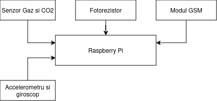

# IoT System for Forest Monitoring

### Introducere:

Proiectul isi propune sa creeze un sistem IoT capabil sa detecteze incediile forestiere prin intermediul unor senzori de lumina si CO2. 
De asemenea, ar fi capabil sa inregistreze alunecarile de teren prin intermediul unui giroscop. Comunicarea se va face folosind protocolul
 MQTT, peste retelele 4G/3G pentru a transmite date de la placuta catre Broker, si peste internet pentru a comunica cu site-ul web
 pentru a notifica utilizatorii. Broker-ul va fi monitorizat folosind Grafana.

Va exista un threshold pentru senzorul de lumina si un threshold pentru senzorul de CO2, care atunci
cand sunt atinse, va fi trimis un mesaj catre broker. Pentru trimiterea mesajului de avertizare, va trebui fie ca:
senzorul de CO2 sa depaseasca threshold-ul sau ambii senzori sa il depaseasca. Am ales aceasta metoda pentru evitarea
alarmelor false generate de lumina prea puternica care loveste senzorul.

Pentru detectarea alunecarilor de teren, ma folosesc de modulul cu accelerometru si giroscop. 
Diferenta dintre alunecarea de teren si simpla taiere a poate fi facuta cu ajutorul accelerometrului,
care detecteaza o accelerare de instensitate mare si liniara pentru taierea unui copac si o accelerare 
neliniara in cazul alunecarii de teren.

### Arhitectura:

Pentru inceput, am conectat modulul cu senzorul de gaz, capabil sa detecteze si fum, la VBUS,
pentru a asigura o alimentare de 5V, ceilalti pini au fost conectati la GND si la pinul 31 al placutei
RaspberryPi Pico WH, pentru ca acesta este un pin analogic.

Modului cu fotorezistor este capabil sa functioneze si la 3.3V, dar si la 5V, de aceea, am decis sa il
conectez si pe acesta la VBUS. Ceilalti pini sunt GND si un pin de GPIO de pe placuta (pin-ul 4).

Modulul de accelerometru si giroscop va fi conectat la 3V3 (OUT), pinul 36 de pe placuta, la GND, SCL
la pinul 12 al placutei si SDA va fi conectat la pinul 11 (pini de GPIO). AD0 va fi lasat deconectat.
Pinul INT (pentru intreruperi) poate fi lasat deconectat, in functie ne nevoi, altfel, el poate fi
conectat la orice pin de GPIO.

Modulul GSM SIL800L, din cauza tensiunii de alimentare necesare aflata in intervalul [3V4, 4V4], va fi
alimentat tot de la VBUS, folosind un modul DC-DC care va avea ca output in jur de 3V7-3V8 pentru a
asigura functionalitatea optima a modulului GSM. Ca pini, pin-ul 1 va fi conectat la RXD si pin-ul 2
la TXD.

