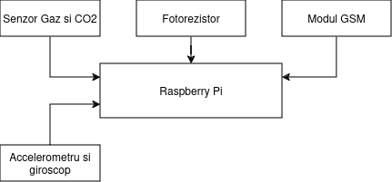
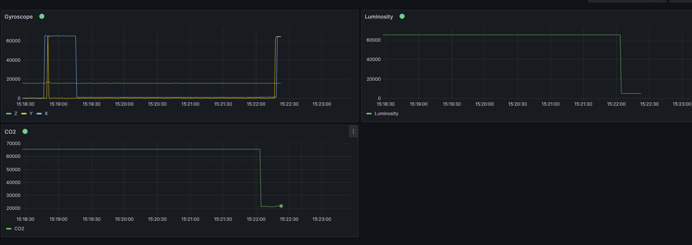
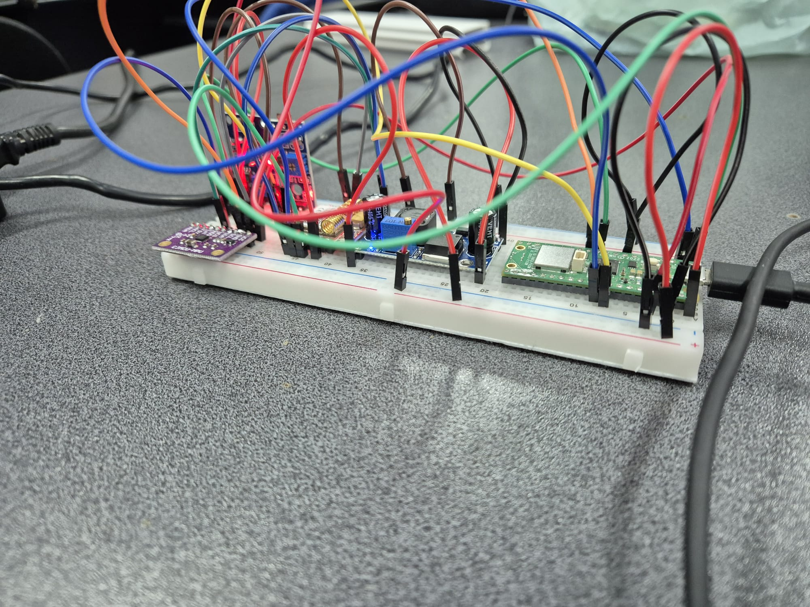
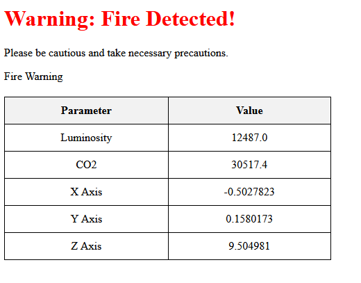
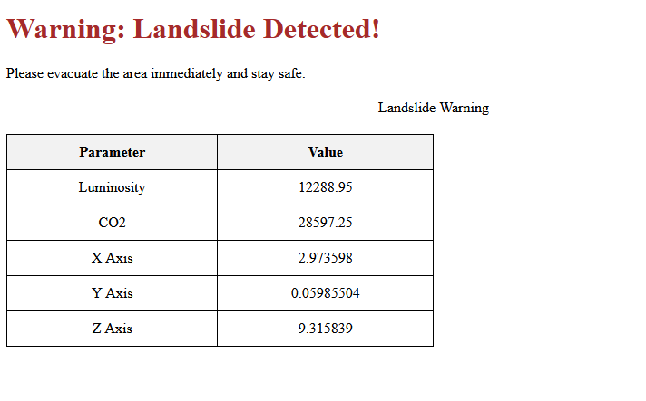

# <ins>IoT System for Forest Monitoring</ins>

### <ins>Introducere:</ins>
 
Proiectul isi propune sa creeze un sistem IoT capabil sa detecteze
incediile forestiere prin intermediul unor senzori de lumina si CO2. 
De asemenea, ar fi capabil sa inregistreze alunecarile de teren prin
intermediul unui giroscop. Comunicarea se va face folosind protocolul
MQTT, peste retelele 4G/3G pentru a transmite date de la placuta catre
Broker, si peste internet pentru a comunica cu site-ul web
pentru a notifica utilizatorii. Broker-ul va fi monitorizat folosind Grafana.

Va exista un threshold pentru senzorul de lumina si un threshold pentru
senzorul de CO2, care atunci cand sunt atinse, va fi trimis un mesaj
catre user. Pentru trimiterea mesajului de avertizare, va trebui fie ca:
senzorul de CO2 sa depaseasca threshold-ul sau ambii senzori sa il
depaseasca. Am ales aceasta metoda pentru evitarea
alarmelor false generate de lumina prea puternica care loveste senzorul.

Pentru detectarea alunecarilor de teren, ma folosesc de modulul cu
accelerometru si giroscop. Diferenta dintre alunecarea de teren si
simpla taiere a poate fi facuta cu ajutorul accelerometrului,
care detecteaza o accelerare de instensitate mare si liniara
pentru taierea unui copac si o accelerare neliniara in cazul alunecarii de teren.

### <ins>Arhitectura</ins>:

Pentru inceput, am conectat modulul cu senzorul de gaz,
capabil sa detecteze si fum, la VBUS, pentru a asigura o alimentare
de 5V, ceilalti pini au fost conectati la GND si la pinul 31 al placutei
RaspberryPi Pico WH, pentru ca acesta este un pin analogic.

Modului cu fotorezistor este capabil sa functioneze si la 3.3V, dar si
la 5V, de aceea, am decis sa il conectez si pe acesta la VBUS.
Ceilalti pini sunt GND si un pin de GPIO de pe placuta (pin-ul 32).

Modulul de accelerometru si giroscop va fi conectat la 3V3 (OUT),
pinul 36 de pe placuta, la GND, SCL la pinul 12 al placutei si SDA
va fi conectat la pinul 11 (pini de GPIO). AD0 va fi lasat deconectat.
Pinul INT (pentru intreruperi) poate fi lasat deconectat, in functie ne nevoi,
altfel, el poate fi conectat la orice pin de GPIO.

Modulul GSM SIL800L, din cauza tensiunii de alimentare necesare aflata in
intervalul [3V4, 4V4], va fi alimentat tot de la VBUS, folosind un modul
DC-DC care va avea ca output in jur de 3V7-3V8 pentru a asigura functionalitatea
optima a modulului GSM. Ca pini, pin-ul 1 va fi conectat la RXD si pin-ul 2
la TXD.

Brokerul va fi monitorizat folosind Grafana, unde am configurat un 
dashboard cu 3 grafice, unul pentru giroscop, unul pentru fotorezistor
si altul pentru senzorul de CO2.

### <ins>Implementare:</ins>

Pentru realizarea proiectului, am inceput prin conectarea
componentelor pe breadboard, la fel cum le-am descris in
capitolul anterior, "Arhitectura".

Dupa ce m-am asigurat ca piesele au fost conectate, am
instalat MicroPython pe placuta RaspberryPi Pico W,
urmarind indicatiile din laborator, dar alegand un
bootloader specific placutei mele, de pe link-ul urmator:
https://micropython.org/download/RPI_PICO_W/.

Pentru Broker-ul MQTT am ales sa folosesc Mosquitto,
deoarece a fost deja configurat in timpul laboratorului.

Pentru instalarea mosquitto, am urmat pasii descrisi in
laborator:
    1. Descarcare Mosquitto de pe link-ul: https://mosquitto.org/download/
    2. Instalarea Mosquitto si adaugarea acestuia in PATH.

Pentru a rula mosquitto, voi rula intr-un Command Prompt comanda:
mosquitto -v -c “C:\Program Files\mosquitto\mosquitto.conf”. Am ales
sa rulez pe Windows, deoarece pe Linux am intampinat cu rularea
Broker-ului MQTT.

Ca tool de monitorizare, am ales sa folosesc Grafana, deoarece
l-am configurat o data in timpul cursului si datorita extensiei
de MQTT prezenta deja in Grafana, totul a fost destul de usor
de configurat. O problema pe care am intampinat-o pe parcursul
configurarii a fost selectarea unor tranformari pentru crearea
unor grafice.

In dashboard, am configurat 3 grafice, unul pentru informatiile
primite de la accelerometru, unul pentru luminozitate si altul
pentru pentru CO2. Datele nu sunt stocate, datele din grafice
aparand doar de la pornirea placutei si odata cu transmiterea
primului mesaj catre MQTT Broker.

#### <ins>Conctarea la internet:</ins>

Pentru a ma conecta la internet am folosit codul din fisierul:
simple.py, folosit si in cadrul laboratoarelor, conectandu-ma
la hotspot-ul facut de laptop.

#### <ins>Trimiterea mesajelor catre Broker-ul MQTT:</ins>

Mesale sunt trimise pe topic-ul "senzori" sub froma unui 
dictionar, pentru a putea fi mai usor tratate de catre Grafana
si afisate mai usor in graficele din Dashboard.

#### <ins>Bot-ul de Telegram:</ins>

Pentru a trimite mesaje catre chat-ul de Telegram atunci cand
s-a produs un hazard, am urmat pasii descrisi in laborator:

    1. Am folosit token-ul API furnizat de BotFather si chat_id-ul
    rezultata din conversatie.
    2. Am folosit metoda post din modului urequests catre un
    URL custom de forma: https://api.telegram.org/bot{bot_token}/sendMessage, pentru a trimite mesajului.

#### <ins>Serverul Flask:</ins>

Am creat un server self-hosted folosind Flask. Acesta este 
simplu, alcatuit din doar din doua endpoint-uri, root ("/")
unde for fi randate paginile HTML in functie de campul "Warning".
Endpoint-ul "/info", va trata request-ul primit de la placuta.

Serverul va folosi o conexiune https, creata cu ajutorul 
unui certificat dummy, self-signed, creat de scriptul din 
folderul proiectului. 

#### <ins> Sistemul de alertare si notificare: </ins>

Sistemul de alertare si notificare este constituit din serverul
si BOT-ul de Telegram, ambele descrise mai sus. De
fiecare data cand placuta va trimite un mesaj catre MQTT
Broker, aceasta va trimite si un POST request catre server. Pe
server, este verificat campul "Warning" din mesaj, care va 
indica daca s-a produs un hazard si ce fel de hazard a avut 
loc, iar site-ul va afisa pagina HTML conform acestuia. Campul
"Warning" poate avea 3 valori: None, va fi afisat "No hazards" 
si o pagina HTML doar cu mesajul mentionat anterior; "Fire", va
fi afisata pagina aferenta unui incendiu si "Landslide", va fi
afisata pagina aferenta unei alunecari de teren.

Paginile HTML aferente campului Warning vor fi:

Pentru a nu verifica mereu site-ul pentru detectarea unor 
hazarduri, voi folosi BOT-ul de Telegram pentru a trimite
un mesaj utilizatorului de fiecare data cand se 
produce un hazard. Mesajele sunt trimise automat, de fiecare 
data cand sunt depasite threshold-urile setate pentru fiecare 
senzor. 

### <ins>Vizualizarea si Procesarea de Date:</ins>

Initial, pentru a citi datele de la modulul cu accelerometru si 
giroscop am folosit un filtru trece-jos pentru a ma asigura ca 
iau in considerare doar "slow changes" ale valorilor, incercand 
sa compensez pentru imprecizia senzorului. Insa, am observat ca 
aceasta metoda nu producea rezultate satisfacatoare, avand 
foarte multe valori false-positive, in care era detectata o 
miscare "rapida" atunci cand nu era cazul. Pentru a rezolva 
aceste probleme am folosit o biblioteca pentru modulul MPU6500 
(https://github.com/tuupola/micropython-mpu9250/blob/master/
mpu6500.py) si am observat rezultate mult mai bune.  
Aceleasi probleme le-am intampinat si la giroscop, unde doar 
citeam valorile si le transformam din intervalul [0, 65k] in 
[-32k, 32k]. Chiar daca valorile date de giroscop nu 
influentau la fel de mult rezultatele, deoarece alunecarile
de teren erau de cele mai multe ori date de deplasarea liniara
calculata cu ajutorul datelor obtinuta de la accelerometru,
am ales sa folosesc biblioteca mentionata anterior si pentru a
citi valorile inregistrate de giroscop.

Pentru a detecta un incendiu, citesc valorile date de senzorul 
de CO2 si de luminozitate, pe care, pentru a obtine anumite 
valori cu mai putine fluctuatii mai mici, am decis ca inainte de
obtinerea rezultatului sa citesc 20 de sample-uri si voi returna
media valorilor. Valorile calculate sunt comparate cu anumite 
threshold-uri, iar daca ambele sunt depasite, voi trimite 
avertizarea de incendiu.

Pentru a detecta un incendiu, citesc valoare analogica de la 
senzori (cel de CO2 si de la fotorezistor) si daca,
impreuna trec de un anumit prag, voi trimite avertizarea de 
incendiu.

### <ins>Securitate:</ins>

Am folosit un certificat self-signed, iar pentru crearea
acestuia m-am folosit de biblioteca: "cryptography",
mai exact de modulul x509, care este folosit pentru
crearea si utilizarea certificatelor X.509. Am creat o
cheie privata folosind functia "generate_private_key" din
rsa, cu o dimensiune a cheii de 2048 de biti, deoarece
aceasta dimensiune parea sa fie cea mai des intalnita.
Dupa creare, am salvat cheia in fisierul "key.pem",
necriptata. Urmatorul pas a fost crearea unui subiect si
a unui issuer. Certificatul a fost facut cu ajutorul clasei
CertificateBuilder din biblioteca x509.

Asigurata de comunicarea HTTPS a serverului. Placuta
trimite POST request-ul prin intermediul metodei post din 
modulul de urequests care este capabil sa foloseasca intern
modulul de ssl pentru crearea unor "secure sockets - 
over HTTPS" .

### <ins>Provocari si Solutii:</ins>

1. Achizitionarea componentelor:

    Prima problema a constat in alegerea unor componente
    care sa functioneze la tensiuni de alimentare similare.
    Am reusit sa achizitionez un senzor de gaz / CO2 care
    are nevoie de o tensiune de alimentare de 5V, un
    modul cu giroscop si accelerometru care este alimentat
    la 3V3 si un modul GSM care are nevoie de alimentare
    intre 3V4 si 4V4. Am reusit sa alimentez primele 2
    componente la pinii placutei RaspberryPi Pico W, iar
    pentru modulul GSM, a achizitionat un modul DC-DC
    pentru a reduce tensiunea de alimentare de la 5V la
    4V2.

2. Asamblarea tuturor componentelor pe breadboard:
    
    Din cauza numarului mare de componente dar si a 
    spatiului limitat de pe breadboard, a fost 
    dificil sa gasesc o configuratie capabila sa
    acomodeze toate piesele.

3. Interferentele dintre componente:

    Din cauza problemelor de la punctul (1), 
    cablurile ajung sa fie destul de aglomerate,
    la fel si senzorii si unele componente produc
    rezultate influentate de alte componente (senzorul de CO2 isi schimba valoare atunci
    cand fotorezistorul detecteaza lumina). Pentru a rezolva
    aceasta problema, am ales sa modific Pin-ul la care este
    conectat fotorezistorul, astfel, cele 2 componente vor
    folosi diferite ADC-uri.

4. Alegerea unei metode care asigura transmiterea sigura a datelor:

    Prima data am incercat sa folosesc OpenSSL care 
    presupunea instalarea diferitelor tool-uri pe 
    Windows, la final am ales sa merg pe 
    implementarea folosind un server Flask cu HTTPS.

5. Valorile neconstate date de senzori:

    Desi la inceput, implementarea unui filtru
    "trece-jos" pentru a reduce zgomotul a parut suficienta,
    inca intampinam suficient zgomot, de aceea am ales sa
    ma folosesc de o librarie deja implementata, obtinand
    rezultate mai bune.

6. Modulul GSM:

    Dupa mai multe incercari, nu am reusit sa fac modulul
    GSM sa se contecteze la retea. Am incercat sa fac debug
    folosind comezile de AT, neprimind niciun raspuns,
    nereusind sa imi dau seama care este problema.

7. Configurare Grafana:

    In timpul configurarii am intampinat probleme la alegerea
    transformarilor corecte astfel incat datele trimise sa
    fie automat afisate in grafic, care s-a rezolvat prin
    trial-and-error cu optiunile date de Grafana. 
    De asemenea, o alta problema pe care am intampinat-o a
    fost formatul mesajului catre MQTT Broker astfel incat
    acesta sa fie interpretat automat de Grafana. La final,
    am ales sa merg pe JSON, fiind parsat automat.
    